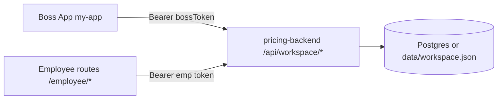

# Employee / Boss cloud workspace (MVP)

Ideal Solutions uses one Expo app (`my-app`) for the contractor **Boss** experience and an in-app **Employee** mode, backed by the shared **pricing-backend** API (`pricing-backend`).

## Architecture



| Layer | Location |
|--------|-----------|
| SQL schema | `pricing-backend/src/db/schema.ts` (`WORKSPACE_SQL`) |
| API routes | `pricing-backend/src/routes/workspaceRoutes.ts` |
| Store (PG + JSON fallback) | `pricing-backend/src/workspace/` |
| Mobile client | `my-app/lib/cloud/` |
| Boss invites UI | Settings → **My crew** → Cloud crew invites |
| Employee onboarding | `/employee/join` (code or `?code=`) |
| Employee home | `/employee` |
| Permissions | `my-app/lib/cloud/permissions.ts`, `EmployeeRouteGuard` |

## Environment

### pricing-backend (`pricing-backend/.env`)

| Variable | Purpose |
|----------|---------|
| `DATABASE_URL` | Optional Postgres; without it, workspace data uses `data/workspace.json` |
| `PORT` | Default `3001` |
| `WORKSPACE_APP_BASE_URL` | Optional default for invite deep links (e.g. `ideal-solutions://` or web URL) |

Run migrations when using Postgres:

```bash
cd pricing-backend
npm run migrate
npm run dev
```

### my-app (`my-app/.env`)

| Variable | Purpose |
|----------|---------|
| `EXPO_PUBLIC_PRICING_API_URL` | Root URL of pricing-backend (required for cloud) |
| `EXPO_PUBLIC_APP_DEEP_LINK_BASE` | Optional; used when creating invite links |
| `EXPO_PUBLIC_EAS_PROJECT_ID` | Optional; needed for Expo push token registration |

## Auth (MVP)

- **Boss:** `POST /api/workspace/company` with `bossDeviceId` → `bossToken` stored in AsyncStorage (`ideal_boss_cloud_session_v1`).
- **Employee:** `POST /api/workspace/invites/redeem` with invite code → `emp_*` token stored in `ideal_employee_session_v1` as `cloudAuthToken`.
- Requests use `Authorization: Bearer <token>`.

Not included in MVP: refresh tokens, OAuth, password login.

## API surface (MVP)

| Method | Path | Who |
|--------|------|-----|
| POST | `/api/workspace/company` | Boss (register) |
| GET | `/api/workspace/company` | Authenticated |
| POST | `/api/workspace/invites` | Boss |
| GET | `/api/workspace/invites` | Boss |
| POST | `/api/workspace/invites/redeem` | Public (code) |
| GET/POST | `/api/workspace/messages` | Authenticated |
| GET/POST | `/api/workspace/assignments` | Boss assign / employee list |
| GET | `/api/workspace/notifications` | Authenticated |
| POST | `/api/workspace/push-token` | Authenticated (register only) |

## What works now (MVP)

- Company registration on cloud from boss device
- Invite codes + optional share link in SMS/email copy
- Employee redeem → session linked to company
- Team chat: send/list over REST, client polls every 12s
- Job list filtering hook when cloud assignments exist (local job id must match `jobId` on assignment)
- Employee route guard blocks billing/estimates/subscribe paths
- Push token registration stub (`expo-notifications`); server does not send pushes yet
- Offline-first boss data unchanged (AsyncStorage jobs, crew, time clock)

## Phase 2 (not in MVP)

- True push delivery (Expo Push API + server worker)
- WebSockets or SSE for realtime chat
- Separate App Store / Play listing for “Employee App”
- Full job/schedule/photo sync from cloud
- Boss grants per-employee `permissions` flags in UI
- JWT with expiry and refresh
- Job-folder chat channels per job
- Encrypted tokens at rest

## Local testing flow

1. Start `pricing-backend` with `EXPO_PUBLIC_PRICING_API_URL` pointing at your LAN IP.
2. Boss: Settings → My crew → **Create invite code** → share code.
3. Employee: `/employee` → **Enter invite code** → join.
4. Optional dev: Settings → Employee AI → toggle employee session without cloud.
