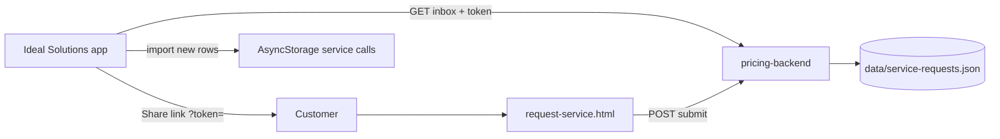

# Request Service — customer link feature

Contractors send a **Request Service** link by text or email. Customers open it in a mobile browser (no Ideal Solutions app, no login), submit the form, and the request appears in **Service calls → Current** after sync.

## Architecture



| Layer | Role |
|--------|------|
| **App** | Stable `contractorToken` per device; send link UI; sync inbox on app foreground + Service calls focus |
| **pricing-backend** | Public form + `POST /api/service-requests/submit` + `GET /api/service-requests/inbox` |
| **Local storage** | Existing `ServiceCallRecord` rows extended with workflow status, photos, `remoteRequestId` |

Job Folders and manual service calls are unchanged. Customer-link rows use the same `ServiceCallForm` fields and completion flow.

## Environment variables (my-app)

| Variable | Purpose |
|----------|---------|
| `EXPO_PUBLIC_PRICING_API_URL` | LAN/production API root (e.g. `http://192.168.1.10:3001`). Enables hosted form URL and inbox sync. |
| `EXPO_PUBLIC_CUSTOMER_REQUEST_URL` | Optional override if the HTML form is not served from pricing-backend (static host). |
| `EXPO_PUBLIC_SERVICE_REQUEST_BASE_URL` | Optional dedicated form/API host (else uses pricing URL). |
| `EXPO_PUBLIC_SERVICE_REQUEST_API_URL` | Legacy alias for `SERVICE_REQUEST_BASE_URL`. |

Subscriptions are not gated for this flow (`SUBSCRIPTIONS_DISABLED_FOR_TESTING` / `EXPO_PUBLIC_SUBSCRIPTIONS_DISABLED`).

## Run locally

### 1. pricing-backend

```powershell
cd "C:\Users\trace\OneDrive\Ideal Solutions\Ideal Solutions\pricing-backend"
npm run dev
```

Health check: `http://127.0.0.1:3001/health`

Customer form (short link): `http://127.0.0.1:3001/r/test-token?companyName=Demo`

Alternate paths: `/request-service/{token}` or `/request-service?token=...`

### 2. my-app

In `my-app/.env`:

```
EXPO_PUBLIC_PRICING_API_URL=http://YOUR_LAN_IP:3001
```

Restart Metro: `npx expo start -c`

### 3. Test flow

1. **Service calls → Send Customer Service Call Link** → Text or Email (or copy link).
2. Open the link on a phone browser (or desktop); submit the form.
3. Confirm: “Your service request has been sent.”
4. In the app, open **Current service calls** (pulls inbox) — new row with status **New**, photos, customer fields.
5. Open the call → change status, call/text/email, **Create job folder from request**.

## Deploy notes (customer URL base)

**Recommended:** deploy `pricing-backend` with HTTPS and set in EAS / production `.env`:

```
EXPO_PUBLIC_PRICING_API_URL=https://api.yourdomain.com
```

Shared links become:

`https://api.yourdomain.com/r/<contractorToken>?companyName=Your+Company`

**Alternative:** host `my-app/public/customer-request-invite.html` on static HTTPS and set:

```
EXPO_PUBLIC_CUSTOMER_REQUEST_URL=https://www.yourdomain.com/customer-request-invite.html
```

The page must receive `token`, `companyName`, and `apiBase` query params (same as the backend-hosted form).

Persist `pricing-backend/data/` on the server or migrate to Postgres later; `future` fields on records are reserved for calendar, auto-reply, estimates, push, and payments.

## Contractor notifications (new customer requests)

When inbox sync imports a row the device has not seen before, the app shows a **local notification** to the contractor (boss/owner):

- Title reflects priority (New / Urgent / Emergency service request).
- Body includes customer name and problem summary when available.
- Employee test sessions do not receive these alerts.

**How sync runs**

- On app launch and whenever the app returns to **foreground** (`ServiceRequestSyncWatcher` in root chrome).
- When **Service calls** screens gain focus (existing behavior — list still refreshes as before).

**Permissions**

- iOS/Android: the first new request triggers the system notification permission prompt (if not already granted).
- Denied permission: requests still import silently; only the in-app list updates.

**Expo Go vs dev/production build**

| Environment | Local notification on new request |
|-------------|-------------------------------------|
| **Dev client / store build** | Supported (uses `expo-notifications`) |
| **Expo Go (SDK 53+)** | Module not loaded — no local alert; open Service calls to see new rows |
| **Expo Go on Android** | Same as above; remote Expo push is also unavailable |

**Remote push (future)**

`pricing-backend` workspace routes can register Expo push tokens (`POST /api/workspace/push-token`) but server-side send is still phase 2. Service-request inbox has no push hook today — polling + local notification is the MVP.

## API reference

- `POST /api/service-requests/submit` — public customer submit (JSON, photos as base64, max 8).
- `GET /api/service-requests/inbox?contractorToken=…` — contractor sync.
- `PATCH /api/service-requests/:id/status` — optional remote status sync.

## Files touched

**pricing-backend:** `src/serviceRequests/*`, `src/routes/serviceRequestRoutes.ts`, `public/request-service.html`, `src/index.ts`

**my-app:** `lib/contractorRequestToken.ts`, `lib/serviceRequestApi.ts`, `lib/serviceRequestSync.ts`, `lib/serviceRequestNotifications.ts`, `lib/serviceRequestAlertDelivery.ts`, `lib/customerServiceRequest.ts`, `lib/serviceCallStorage.ts`, `components/serviceCalls/ServiceRequestSyncWatcher.tsx`, `app/service-calls/send-link.tsx`, components under `components/serviceCalls/`, `app/service-calls/[id].tsx`, `app/job-folder/new.tsx`
